# Стъпки на разработка на проекта

## Използвани технолигии

Използва се PostgresSQL база данни. Backend API-то е уеб сървър на Python с Flask WSGI. Клиентът е браузър, които е получил статични файлове като HTML, CSS, JS от Vite development web server.

## Базата данни

Схемата се състои само от 2 основни таблици(всъщност са 3, но едната все още не се ползва). Едната таблица пази видовете инструменти(засега се поддържат само 2). Втората таблица съдържа историческите котировки на тези инструменти.

Таблиците на базата данни се създават с миграции и ORM-a SQLAlchemy и SQL querybuilder-a Alembic. Тоест на Python пишем класове, които после се интерпретират от SQLAlchemy и се създват миграции(пак Python код), които после се използват за генериране на SQL заявки от Alembic.

Моделите може да се видят с пакета app.models в server папката. Връзката с базата данни може да се види в папката server/alembic в модула env.py файла. Направените миграции са в server/alembic/versions

## Генерирането на цена на актив

Backend приложението, написано на Python, има няколко отговорности. Първата е генериране на цена на актив в реално. Използва се многонишково програмиране: една нишка за всеки актив. Използва се алгоритъм за random-walk, или по-точно казано, AR(1) без епсилон величина(шум). Той генерира следващата цена на актив, съседна на текущата цена, зависеща от коефициент на вероятност за това дали цената да продължи в същата посока или да се "завърти". Този коефициент e ϕ и се сменя от друга нишка през НЕфиксиран времеви интервал в фиксиран краен домейн. Новата цена се генерира през фиксиран времеви интервал. Цените на активите са дискретни - единицата се нарича tick - най-често активите са с 0.25 tick size.

Това е формулата за условна вероятност за посоката на следващия tick:
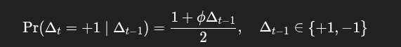
Тоест:

> Ако ϕ>0: персистентност / momentum (по-вероятно е да продължи в същата посока)

> Ако ϕ<0: mean-reversion на знак / анти-персистентност (по-вероятно е да обърне посоката)

> Ако ϕ=0: 50/50

Новото ϕ се избира в интервала [x,y], където -1 > x > 0 и 0 < y < 1, като е избрано x=-0.8 и y=0.8, защото примерно дори и да има по-голяма вероятно да се случи запазване на посоката на следващия tick, то да има вероятност тя да се смени.

Новогенерираната цена се запазва в базата данни и се праща на "събсрайбъри" за websocket за текущата цена(за това по-надолу).

Това е имплементирано в price_generation.py.

Нейното генериране започва със стартирането на flask_server.py.

## Пращането на историческа цена на актив

Комуникацията между сървър и клиент се случва по HTTP. Заявките се приемат от webserver(които ако е development webserver, е Wergzeug). Flask e web framework, който помага с четенето на HTTP заявката по мрежата и парсването ѝ, като я трансформира до Python "примитиви", които са лесни за използване. Примерно трябва да се вземата path параметрите или query параметрите. Или да се рутира заявка с подаден път до python функция, която да се изпълни.

Важно: Flask не определя многонишковостта. Видът webserver, който може да ползва WSGI Flask, определя това. Wergzeug създава нишка за всяка заявка. Пример за друг уебсъвър, които работи със threadpool с фиксиран размер е Waitress и той се ползва на production.

В проекта има имплементация на selector шаблона с threadpool в модула selector_server.py. За този сървър, ще бъде описано по-надолу.

## Пращането на новогенерирата цена на актив в реално време

Изпращането на цената в реално време на определени клиенти изисква поддържането на мрежова връзка между сървъра и клиента. Такава връзка се създава и поддържа с протокола Websockets, който изисква да се направи handshake между сървъра и клиента по HTTP и после да се комуникира по TCP.

За целта се изпозва библиотеката socketio, която се базира на този протокол. Ако уебсокети не се поддържат от браузъра, се преминава към стандарните long/short polling.

Когато клиентът отиде на определена страница, се инициира "websocket" връзка. Тоест започва се обмяна на HTTP заявки и отговори с цел да се установи връзка между клиента и сървъра и после да може клиентът да се абонира за промяна на котировката на актива. От страната на сървъра, той държи списък със сокет дескриптори, които да ползват за пращане на новата цена, когато тя се генерира. В модула за генериране на цена се извиква callback функция, която уведомява със socketio.emit() абонати за даден финансов актив. Самите абонати се разделят на групи спрямо това за кой актив искат да "слушат". Така че при промяна на цената на даден актив не се уведомяват всички "събскрайбъри", а само тези, които са в съответната група. Цялата логика по приемане на абонати, за тяхното групиране, за изпращането на пакети и за подтвърждаване за тяхното пристигане, се грижи socketio библиотеката.

## Имплементация на експонента на Hurst

1. Цел и предназначение

Hurst експонентата за 1-минутна ценова редица е индикатор и използва R/S анализ (Rescaled Range). Изчислението е паралелизирано чрез multiprocessing.Pool, за да се ускори обработката при множество размери на прозореца.

Hurst експонентът е индикатор за дългосрочна зависимост (long-range dependence) в редица от наблюдения:

> H≈0.5: поведение близко до случайна разходка (без памет).

> H>0.5: персистентност (тренд/моментум).

> H<0.5: анти-персистентност (mean-reversion).

Важно: в тази версия не се работи върху ценовите нива, а върху инкрементите (разликите) между последователни цени.

2. Входни данни

Функцията hurst_exponent_minutes_rs_multiprocessed() приема:

minute_series: List[float] — списък от цени по минути (raw prices).

От тях се конструира редица от разлики:

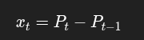
​
която е по-близка до стационарна редица спрямо директните ценови нива.

3. Основен алгоритъм (R/S анализ)

За даден размер на прозореца `w` Редицата се разделя на неприпокриващи се сегменти (chunk-ове) с дължина `w`. За всеки сегмент се изчислява:

Средна стойност:

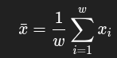
​

Кумулативни отклонения от средната:

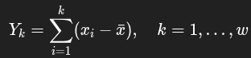

Range (размах):

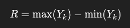

Standard deviation (стандартно отклонение):

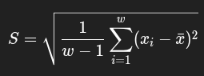

Rescaled range: `𝑅 / S`

За конкретен прозорец `w` се взима средната стойност на `R/S`през всички chunk-ове.

4. Оценка на Hurst експонента

За различни прозорци `w` се предполага зависимост:
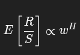

Логаритмизирайки:

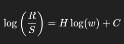

Следователно
H се оценява като наклона на линейна регресия върху точките:

`x=log(w)`

`y=log(mean(R/S))`

В кода регресията се реализира чрез linreg_slope() (наклон от метода на най-малките квадрати).

5. Избор на прозорци

Функцията `logspace_intervals(min_w, max_w, count)` генерира списък от размери на прозореца `w`, разпределени логаритмично между min_window и max_window. Това осигурява покритие на различни скали (малки и големи прозорци) без да се взимат прекалено много близки стойности.

6. Паралелизация

Изчислението на средното `R/S` за различните прозорци `w` е независимо, затова се паралелизира:

Създава се Pool(processes=workers)

Извиква се `pool.map(rs_mean_for_window, [(data, w) for w in windows])`

Така всеки процес пресмята R/S за конкретен прозорец.

7. Валидации и гранични случаи

Минимален брой точки: min_points (по подразбиране 500, че иначе коефициентът няма смисъл в повечето случаи).

Изискване за минимум валидни прозорци: поне 5 (иначе регресията става нестабилна).

Пропускане на сегменти, за които стандартното отклонение S=0 или изчисленията не са крайни.

8. Публичен API и параметри

hurst_exponent_minutes_rs_multiprocessed(...) -> float

Параметри:

minute_series: цени на завтаряне по минути.

min_points: минимална дължина на редицата (след диференциране).

min_window: минимален размер на прозорец.

max_window: максимален размер на прозорец; ако е None, се задава n / 2.

num_windows: брой логаритмично разпределени прозорци.

num_workers: брой процеси; ако е None, ползва cpu_count()-1.

Резултат: Връща оценка на Hurst експонента 𝐻 като float.

## Имплементация на пермутационна ентропия с формула на Шанън

1. Цел и предназначение

Пермутационна ентропия е базирана на времева редица от 1-минутни цени на затваряне. PE измерва “сложността”/непредсказуемостта на редицата чрез честотите на различни рангови (ordinal) шаблони в локални прозорци.

Резултатът е нормализирана ентропия: `Hnorm ∈ [0,1]`:

стойности близо до 1: ранговите шаблони са почти равномерно разпределени (поведение близо до случайно по отношение на подредбата);

по-ниски стойности: има повторяемост/структура в ранговите модели (по-детерминистично поведение).

2. Входни данни

Функцията permutation_entropy_minutes_multiprocessed() приема:

minute_series: List[float] — минутна редица от цени на затваряне.

3. Параметри: `m` и `tau`

Пермутационната ентропия се дефинира чрез:

`m` — дължина на шаблона / брой точки в локалния вектор;

`tau` — стъпка между точките във вектора.

За всяка стартова позиция `i` се разглежда вектор:

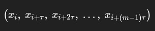

Ако `m`=3, `tau`=1, се взимат последователни тройки.

Ако `tau`>1, се взимат “разредени” точки

4. Рангов шаблон (ordinal pattern)

За всеки вектор се построява пермутация, която описва реда на подреждане на стойностите (ранговете).

Подреждаме по стойност, а при равенства — по индекс k, за да има детерминиран резултат.

5. Броене на честоти на шаблони

Изчислява се честотата на всеки от `m!` шаблона върху цялата редица. Това става чрез предварително построена таблица perm_to_id, която мапва пермутация → индекс [0..m!-1]:

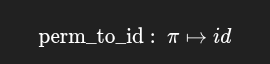

броене в масив `counts[id] += 1`.

6. Как се определя броят валидни стартови индекси

За да е дефиниран вектор с m и tau, трябва да има достатъчно бъдещи точки.

Определяме:

`tail = (m - 1) * tau`

`last_start = n - tail`

Тогава валидните стартови индекси са i=0,1,…,last_start−1.

Това last_start се използва и като общ брой пермутации при ентропията.

7. Изчисляване на Шанонова ентропия

От броячите се построяват вероятности:

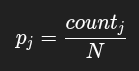

Шанонова ентропия:

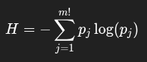

8. Нормализация

Максималната ентропия при равномерно разпределение е:

`Hmax = log(m!)`

Нормализирана ентропия:

`Hnorm = H / Hmax`

която попада в [0,1].

9. Паралелизация

Броенето на шаблони може да се раздели по сегменти, защото отделните стартови позиции са независими.

9.1. Разбиване на задачи

Редицата се разделя на парчета от стартови индекси с размер chunk_starts. За парче със стартови индекси [s, e) се подава сегмент:

`segment = minute_series[s : e + tail]`

`count_starts = e - s`

Важното е, че се добавя tail, за да има достатъчно елементи при последните стартови индекси в парчето.

9.2. Процеси

Ползват се процеси, защото поради GIL(Global Interpreter Lock) нишките не се изпълняват паралелно, а конкурентно.

Броят процеси е:

procs = workers or max(1, cpu_count() - 1)

Ако chunk_starts не е зададен, се избира приблизително:

chunk_starts = last_start / (procs \* 4)

Целта е да има няколко задачи на процес за по-добро натоварване и баланс.

9.3. Сумиране на резултатите

Всеки процес връща частичен counts масив. Накрая се сумират частичните броячи в общия counts.

10. Публичен API и параметри
    permutation_entropy_minutes_multiprocessed(...) -> float

Параметри:

minute_series: входна редица от цени на затваряне.

m: дължина ан вектора (по подразбиране 3).

tau: отстояние между точките (по подразбиране 1).

workers: брой процеси (по подразбиране cpu_count()-1).

chunk_starts: колко стартови позиции да обработи една задача (по подразбиране автоматично).

Резултат:

Връща Hnorm (float) — нормализирана пермутационна ентропия.

11. Изисквания и препоръки за параметрите

m трябва да е ≥ 2, tau ≥ 1.

Редицата трябва да е достатъчно дълга: `n > (m − 1)τ`.

Тъй като броят шаблони е m!, при големи m са нужни повече данни за стабилни оценки. Практически:

m=3 (6 шаблона) е добре при ~500точки
m=5 (120 шаблона) е добре при ~2000 точки,

# За selector_server.py

Използван е еднонишков selector(демултиплексор) на "задачи", който може да изчаква множество сокети/файлови дескриптори и да указва кои от тях са готови за четене или за писане, без активно изчакване (busy-waiting). Когато даден сокет е готов за четене или писане, операционната система събужда тази нишка, ако тя е заспала(вследствие на липса на работа). Тя може да бъде събудена и ако изтече предварително конфигуриран таймер.

Архитектурата комбинира selector с threadpool от фиксиран брой работни нишки. Когато се прочете заявка от сокет и се извика submit(), задачата се поставя в опашка на ThreadPoolExecutor. Ако всички нишки са заети, задачите чакат в тази опашка до освобождаване на нишка. От страна на ОС новите входящи TCP връзки чакат в listen backlog до accept().

А ако дадена нишка вече работи с създадена връзка, но не бива изпълнявана, докато се получават данни, то новодошлите байтове се пазят в буфера на TCP връзката, докато не бъдат прочетени с recv().

С цел по-кратка имплементация, цялата HTTP заявка се чете наведнъж, като съм приел че размерът ѝ няма да е по-голям от 4096 байта.

# Как да подготвим проекта за използване

## Създаване на база данни с име PyTrade в Postgres RDBMS

Трябва да се създаде база данни с това име и с права за писане и четене от потребител postgres. В .env файл трябва да се добави DATABASE_URL. Примерен файл е .env.example в server папката.

## Прилагане на миграциите

Трябва да се приложат съдадените миграции от SQLAlchemy в server/alembic/versions

Командата е:

> alembic upgrade head

## Seed-ване на имена на инструменти в нея

След това тярвба да се добавят имената на финансовите активи с командата:

> python3 -m app.db.seed

## Стартиране на Flask API сървъра

В папката server с командата:

> python3 -m app.flask_server

Трябва да се страрира сървър локално на порт 5000.

## Стартиране на клиента

В папката client с командата:

> npm start

Трябва да се страрира сървър локално на порт 5173.

## Важно

За да работят изчисленията за експонентата на Hurst и на пермутационната ентропия, трябва да се генерира значително количество цени в базата данни. Поне **8 часа** са необходими, особено за експонентата на Hurst, тъй като тя е по-дългосрочен индикатор. Тоест flask_server.py трябва да е пуснат за определено време, преди да се тестват индикаторите.
